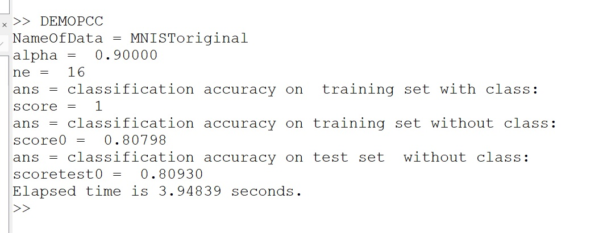

# Principal Component Classification


  

This package contains Matlab code associated with the following publication:  
> [ArXiv:2210.12746](https://arxiv.org/pdf/2210.12746.pdf)
Please cite this  paper when using this code.

## Getting started

Demo is launched by typing in the command window of Matlab (or Octave):
> DEMOPCC

Choice of the dataset can be changed by editing that file header: it is currently set to  process the original MNIST dataset
```
%% Read Data / comment as appropriate
 NameOfData='MNISToriginal'  % original split Xtrain 60000 and Xtest 10000
% NameOfData='MNIST10'      
% NameOfData='wine'
% NameOfData='australian'
```

### Example of Demo output 
Example of output for `MNISToriginal` obtained with Octave 



The model run by default on `MNISToriginal`   uses 16 principal components and as set $\alpha=0.9$.
Accuracy score first reported is for $ {\mathcal{I}_{\mathbf{y}}^{\mathbf{x}}} $ (acc=1), the second is for $\mathcal{I}_{\mathbf{0}}^{\mathbf{x}}$ (acc.= 0.80798) and the last is for test set $\mathcal{I}_{\mathbf{0}}^{\mathbf{x}'}$ (acc.=0.80930)
(see paper for notations used).
The time reported (3.94839 seconds) is for running the full demo (training+testing of the model), here run on Octave on laptop (Surface Pro 7).


## Datasets

MNIST is downloaded from https://github.com/daniel-e/mnist_octave/raw/master/mnist.mat

Datasets *wine* and *australian* are downloaded from https://github.com/PouriaZ/GMML

## Machine design & data encoding with class (DEC)

In supervised learning, we consider available a  dataset $\mathcal{B}=\lbrace(\mathbf{x}^{(i)},\mathbf{y}^{(i)})\rbrace_{i=1,\cdots,N}$ of $N$ observations
with $\mathbf{x}\in \mathbb{R}^{d_{\mathbf{x}}}$ denoting the  feature vector of dimension $d_{\mathbf{x}}$ and $\mathbf{y}\in \mathbb{R}^{n_c}$ the indicator class vector where $n_c$ is the number of classes.
Our approach uses PCA trained on a dataset with training vectors $\mathbf{z}^{(i)}_{\alpha}  $  
concatenating vectors $( (1-\alpha)\mathbf{x}^{(i)} , \alpha\mathbf{y}^{(i)})$. 
Principal Components are then used for classification even if no class information is available at test time to process a new input $\mathbf{x}$.


## Bibtex

```
@techreport{Dahyot_PCC2022,
   author = {Dahyot, Rozenn},
   keywords = {Supervised Learning, PCA, classification, metric learning, deep learning, class encoding},
  abstract={We propose to directly compute classification estimates
by learning features encoded with their class scores. 
Our resulting model has a encoder-decoder structure suitable for supervised learning, it is computationally efficient and performs well for classification on several datasets.},
 title = {Principal Component Classification},
  publisher = {arXiv},
  year = {2022},
   doi = {10.48550/ARXIV.2210.12746},
  url = {https://arxiv.org/pdf/2210.12746.pdf},
}
```
