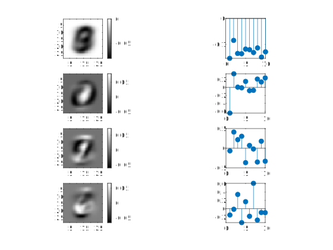
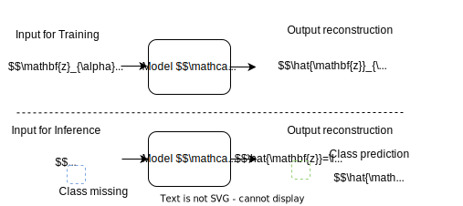

# Principal Component Classification


  

This package contains Matlab code associated with the following publication:  
> [ArXiv:2210.12746](https://arxiv.org/pdf/2210.12746.pdf)
Please cite this  paper when using this code.

## Getting started

Demo is launched by typing in the command window of Matlab (or Octave):
> DEMOPCC

Choice of the dataset can be changed by editing that file header: it is currently set to  process the original MNIST dataset
```
%% Read Data / comment as appropriate
 NameOfData='MNISToriginal'  % original split Xtrain 60000 and Xtest 10000
% NameOfData='MNIST10'      
% NameOfData='wine'
% NameOfData='australian'
```

## Datasets

MNIST is downloaded from https://github.com/daniel-e/mnist_octave/raw/master/mnist.mat

Datasets *wine* and *australian* are downloaded from https://github.com/PouriaZ/GMML

## Machine design: using data encoding with class 



## Bibtex

```
@techreport{Dahyot_PCC2022,
   author = {Dahyot, Rozenn},
   keywords = {Supervised Learning, PCA, classification, metric learning, deep learning, class encoding},
  abstract={We propose to directly compute classification estimates
by learning features encoded with their class scores. 
Our resulting model has a encoder-decoder structure suitable for supervised learning, it is computationally efficient and performs well for classification on several datasets.},
 title = {Principal Component Classification},
  publisher = {arXiv},
  year = {2022},
   doi = {10.48550/ARXIV.2210.12746},
  url = {https://arxiv.org/pdf/2210.12746.pdf},
}
```
